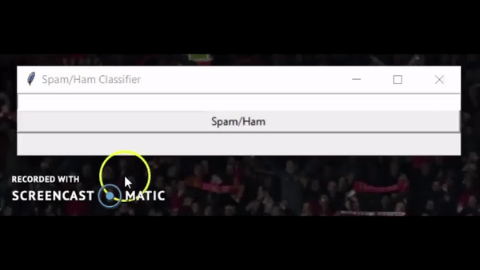

# Spam/Ham Message Classifier

We will be using a dataset from the UCI datasets. The file contains a collection of more than 5 thousand SMS phone messages. The data folder also contains a readme file conating more information of the dataset. Due to the spacing we can tell that this is a TSV ("tab separated values") file, where the first column is a label saying whether the given message is a normal message (commonly known as "ham") or "spam". The second column is the message itself. (Note our numbers aren't part of the file, they are just from the enumerate call).  Using these labeled ham and spam examples, we'll train a machine learning model to learn to discriminate between ham/spam automatically. Then, with a trained model, we'll be able to classify arbitrary unlabeled messages as ham or spam.  link to dataset: https://archive.ics.uci.edu/ml/datasets/SMS+Spam+Collection

Example Messages:

```
ham	Go until jurong point, crazy.. Available only ...
ham	Ok lar... Joking wif u oni...
spam  Free entry in 2 a wkly comp to win FA Cup fina...
ham	U dun say so early hor... U c already then say...
ham	Nah I don't think he goes to usf, he lives aro...

```

### About

We try to classify SMS messages as SPAM or NOT SPAM using various ML algorithms. The notebook (spam_detection.ipynb)consists steps to process and explore the dataset, convert messages to vectors and applying ML techniques for the same. I have used three different ML algorithms and created a pipeline for the same.

### Install

This project requires **Python 3** and the following Python libraries installed:

- [MultinomialNB](https://scikit-learn.org/stable/modules/generated/sklearn.naive_bayes.MultinomialNB.html)
- [Support Vector Machine](https://scikit-learn.org/stable/modules/svm.html)
- [xgboost](xgboost.readthedocs.io/en/latest/build.html)
- [Pipeline](https://scikit-learn.org/stable/modules/generated/sklearn.pipeline.Pipeline.html)
- [CountVectorizer](https://scikit-learn.org/stable/modules/generated/sklearn.feature_extraction.text.CountVectorizer.html)
- [TF-IDF](https://scikit-learn.org/stable/modules/generated/sklearn.feature_extraction.text.TfidfTransformer.html)
- [wordcloud](https://github.com/amueller/word_cloud)
- [sklearn](scikit-learn.org/)
- [pandas](https://pandas.org/)
- [nltk](https://nltk.org/)
- [Matplotlib](https://matplotlib.org/)

Make sure you have [Jupyter Notebook](http://ipython.org/notebook.html) installed.

You could just install [Anaconda](http://continuum.io/downloads) distribution of Python, which already has the above packages and more included. 


### Run

In a terminal or command window, navigate to the top-level project directory (that contains this README) and run one of the following commands:

```bash
ipython notebook spam_detection.ipynb
```  
or
```bash
jupyter notebook spam_detection.ipynb
```

This will open the Jupyter Notebook software and project file in your browser.

## Results 
I got the maximum accuracy with the SVM and I have used the same algorithm in the backend of this Spam/Ham Classifier widget.



## Contributing
Pull requests are welcome. For major changes, please open an issue first to discuss what you would like to change.

Please make sure to update tests as appropriate.

